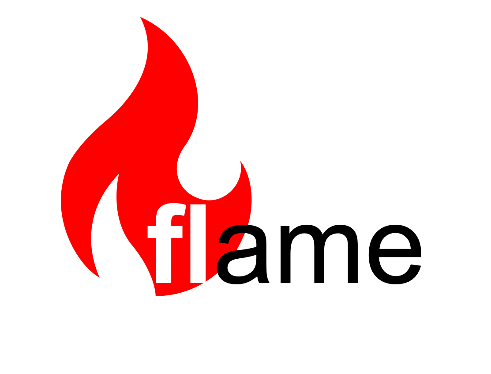

Flame is a platform that enables developers to compose and deploy federated learning (FL) training workloads easily.
The system is comprised of a service (control plane ) and a python library (data plane).
The service manages machine learning workloads, while the python library facilitates composition of ML workloads.
And the library is also responsible for executing FL workloads.
With extensibility of its library, Flame can support various experimentations and use cases.

## Getting started
This repo contains a dev/test environment in a single machine on top of minikube.
The detailed instructions are found [here](docs/03-fiab.md).

## Development setup

The target runtime environment is Linux. Development has been mainly conducted under macOS environment.
For more details, refer to [here](docs/02-getting-started.md).

## Documentation

A full document can be found [here](docs/README.md). The document will be updated on a regular basis.

## Support

We welcome feedback, questions, and issue reports.

* Maintainers' email address: <flame-github-owners@cisco.com>
* [GitHub Issues](https://github.com/cisco-open/flame/issues/new/choose)
