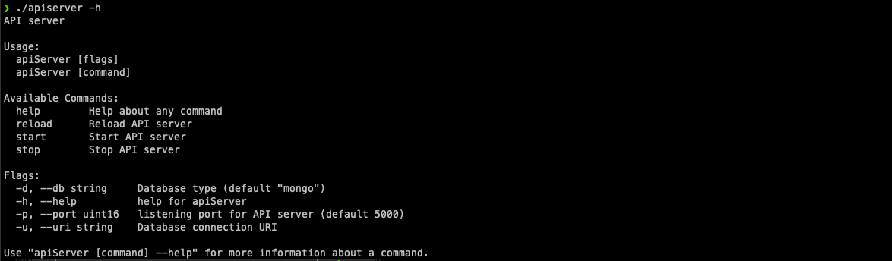
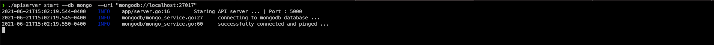
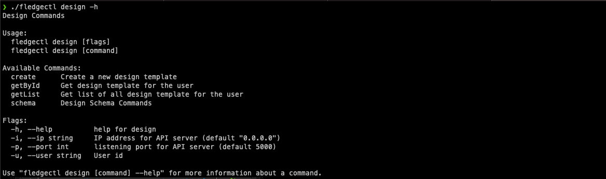
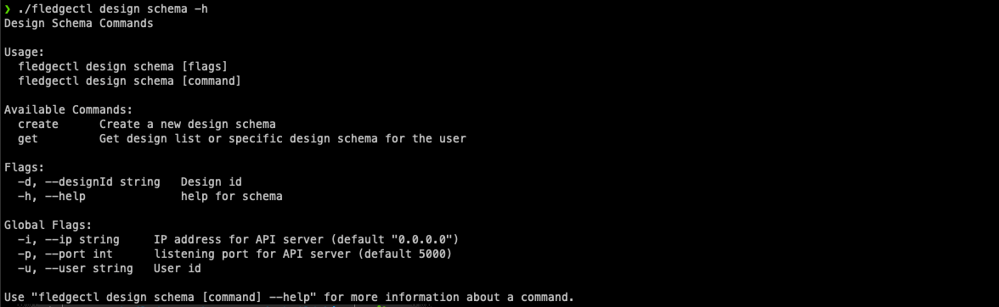
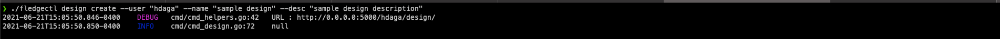
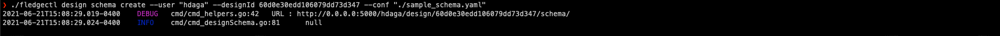
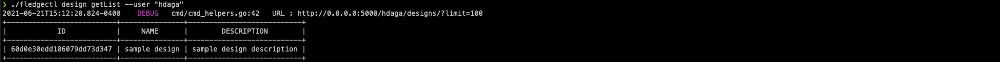
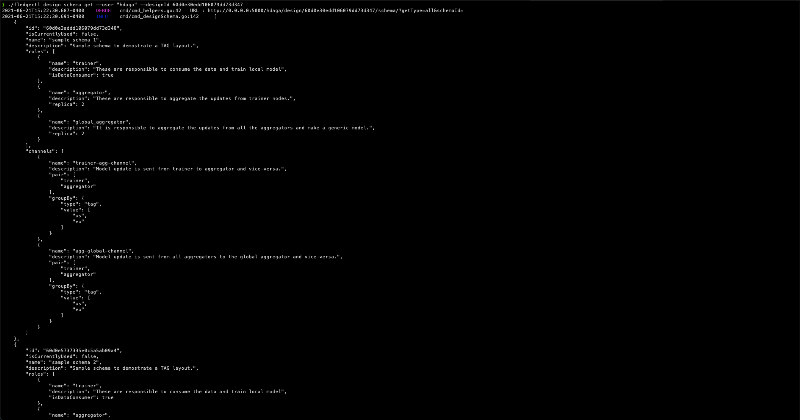
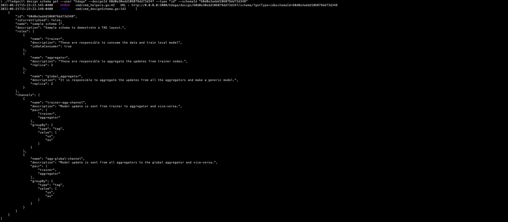

# Installation

The framework provides two executable files. One to start an API server and second to execute commands to perform specific tasks. Running `make local` in the root folder generates these executables in /build/bin folder.


# CLI Examples

## API Server

API servers requires database support to store the information related to designs, jobs etc.. Currently, the framework supports mongodb as the backend database however system can be easily extended for other database such MySQL, etcd, Apache Cassandra.

Instructions to install MongoDB Community Edition on your local machine can be found here [https://docs.mongodb.com/manual/administration/install-community/](https://docs.mongodb.com/manual/administration/install-community/)


**Command Options**




API server requires type of database (in our case mongodb) and its connection URI.

**Start Database**

`mongod --config /usr/local/etc/mongod.conf`

**Start Server**

`apiserver start --db mongo  --uri "mongodb://localhost:27017`

> Example



***

# FledgeCtl
Fledge command line interface provide the following options -





## Create a Design Template
The steps include creating a new design, adding design schema and corresponding code.
Example


* ### New Design

Each user will have their collection of designs and it can be created via

`fledgectl design create --user <userId> --name <name> --desc <schema description>`

> Example


* ### Add Design Schema

To add a design schema through command line we would first need to create a schema yaml configuration file.

**Sample Schema Configuration Yaml**

```
schemas:
  - name: sample schema 1
    description: Sample schema to demostrate a TAG layout.
    roles:
      - name: trainer
        description: These are responsible to consume the data and train local model
        isDataConsumer: true
      - name: aggregator
        description: These are responsible to aggregate the updates from trainer nodes.
        replica: 2
      - name: global_aggregator
        description: It is responsible to aggregate the updates from all the aggregators and make a generic model.
        replica: 2
    channel:
      - name: trainer-agg-channel
        description: Model update is sent from trainer to aggregator and vice-versa.
        pair: ["trainer", "aggregator"]
        groupBy:
          type: tag
          value : ["us", "eu"]
      - name: agg-global-channel
        description: Model update is sent from all aggregators to the global aggregator and vice-versa.
        pair: ["trainer", "aggregator"]
        groupBy:
          type: tag
          value : ["us", "eu"]
```

**Add schema to the existing design template**

`fledgectl design schema create --user <userId> --designId <designId> --conf "<schema.yaml>"`

> Example


* ### Get Design Information

**Get list of all the designs created by the user**

`fledgectl design getList --user "tmpUser"`

> Example


**Get information for a given design template**

`fledgectl design getById --user "tmpUser" --designId $1`

> Example


* ### Get Design Schema Information
Default behavior of schema get command is to provide list of all the schemas for the given design id. This can be changed to obtain information related to specific schema by using `type` as id and providing `schemaId` as shown below.

**Get all the design schemas for the given design**

`fledgectl design schema get --user <userId> --designId <designId> --type all`

> Example


**Get details about specific design schema for the given design**

`fledgectl design schema get --user <userId> --designId <designId> --type id --schemaId <schemaId>`

> Example
