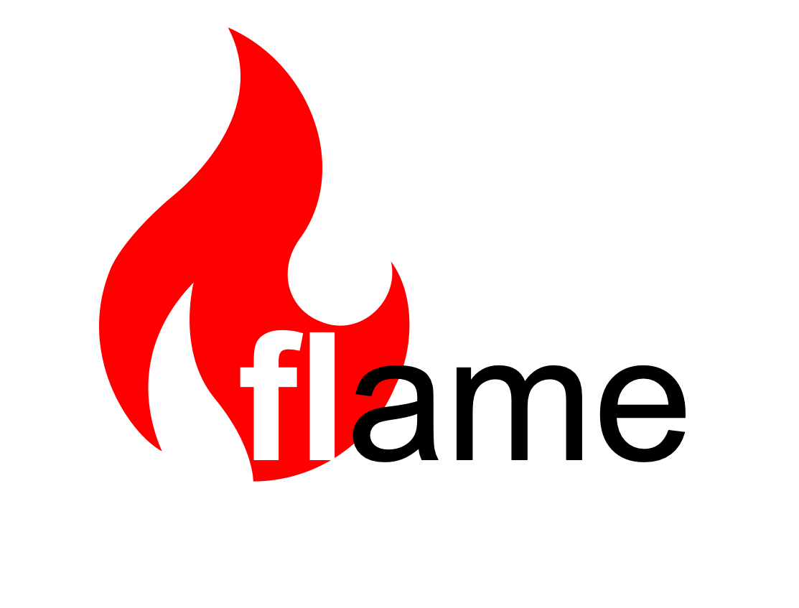
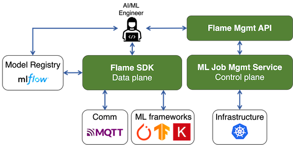
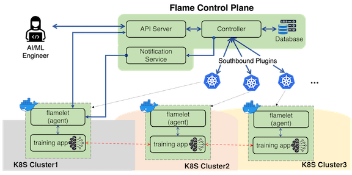

# Introduction

## What is Flame?

The vision of Flame is to democratize federated learning (FL). In that regard, it is the goal of the project that makes FL training as easy and productive as possible for data scientists and machine learning engineers. In particular, as applications and use-cases are emerging in the edge computing space, Flame aims to facilitate FL at the edge.

As FL is a fast evolving technology, Flame tries to decouple the development of a machine learning workload from its deployment and management.
With Flame, a diverse of set of topologies (e.g., central, hierarchical, vertical, hybrid, etc.) can be easily composed
and different backend communication protocols (e.g., mqtt) can be supported.
We cover these core functionalities of Flame [here](05-flame-basics.md).

## Overview

Flame is a platform that allows developers to compose, deploy and manage FL training workloads easily.
The system is comprised of a service (control plane) and a python library (data plane).
In this document, service and control plane are used interchangeably unless mentioned otherwise.
Similarly, for python library and data plane.

The service manages machine learning workloads.
Specifically, the service is responsible for managing operational tasks.
Those are, for instance, allocating/deallocating compute resources, assisting users to design a FL job,
deploying the FL job across many devices based on the specification of the job, etc.
On the other hand, a python library facilitates composition of ML workloads and enables actual FL training.
That's why we use the term (data plane) for the library.

The figure above provides an overview of the flame system.
The control plane consists of four main components: apiserver, controller, notifier and flamelet.
In addition, we rely on MongoDB to store state and information about the system and FL jobs.
Explanation on the service components is found [here](#system-workflow).

A user (herein AI/ML engineer) interacts with the flame system in three ways.
The user first uses the flame python library (Flame SDK from the figure)
to write machine learning code for his/her specific training task (e.g., regression, classification, image segmentation, etc).

Scheduling and executing a FL job requires interactions with the flame system through flame management API.
Specifically, there is a cli tool `flamectl` that implements various functionalities based on flame management API.
The user can use the tool to interact with the flame control plane.

The final interface available to the user is a model registry, which maintains artifacts such as ML models.
Currently, the flame system supports mlflow as its model registry.
Future supports may include registry on top of object storages such as MinIO.

## System Workflow

As aforementioned, the control plane consists of three main components: apiserver, controller, notifier and flamelet.
The apiserver is a front-end of the system; its responsibility is for user authentication, sanity check of requests, etc.
The controller is a core component of the flame system and is responsible for handling user's requests.
As the name stands for, the notifier is a service component that notifies events to flamelet.
The last component, flamelet is an agent that assists the execution of a FL job. It is only executed when a task is deployed.

We use two terms to define a FL job concretely.
One is task and the other is worker. A FL job consists of tasks, which will be executed by workers.
These concepts of task and worker are well established in systems like Apache Spark, MapReduce, etc. And we use them in the similar way.

Given these components, the flame's workflow consists of several steps. The figure above is presented to aid the explanation of the steps.

1. Step 1: A user creates a machine learning job and submits it to the system (e.g., by using `flamectl`).
2. Step 2: The apiserver receives requests and forward it to the controller if requests appears to be valid.
3. Step 3: The controller takes the requests, takes actions, update state in database and returns responses back to the user.
4. Step 4: If the request is to start a job, the controller contacts a cluster orchestration manager(s) (e.g., kubernetes)
and makes worker creation requests.
5. Step 5: The worker (e.g., container or pod) contains flamelet. Then, flamelet in the worker contacts notifier and waits for events.
6. Step 6: As soon as the worker creation is confirmed, the controllers send an event to each of the workers for the job via notifier.
7. Step 7: Once each worker receives an event on a task being assigned to it, it contacts the apiserver and fetches a manifest for the task.
8. Step 8: A manifest is comprised of two elements: ml code and configuration. The flamelet execute the task by creating a child process for the ml code.
9. Step 9: The flamelet monitors the execution of the task and updates the state once the task execution is over.
10. Step 10: In the meantime, the controller also monitors a job's status and take action when necessary (e.g., deallocating workers).

The above workflow can have some variations depending deployment mode.
There are two types of deployment modes: **orchestration** and **non-ochestration**.
In orchestration mode, all the workers are under the management of flame system through the help of cluster orchestrators.
On the other hand, in non-orchestration mode, the workers of consuming data (e.g., training worker) are not under management of the flame system.
The non-ochestration mode is useful in one of the following situations:
* when the flame system doesn't have permission to utilize resources of geo-distributed clusters
* when the geo-distributed clusters are not under the management of one organization
* when participants of a FL job want to have a control over when to join or leave the job

In non-ochestration mode, the fleddge system is only responsible for managing (i.e., (de)allocation) non-data comsuming workers (e.g., model aggregating workers).
The system supports a hybrid mode where some are managed workers and others are non-managed workers.

Note that the flame system is in active development and not all the functionalities are supported yet.
