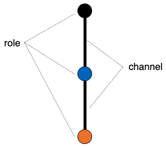
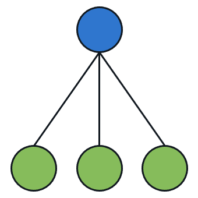
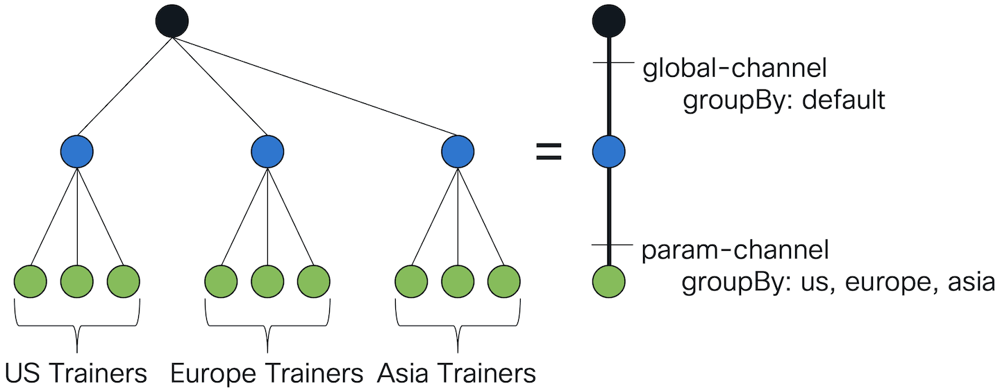
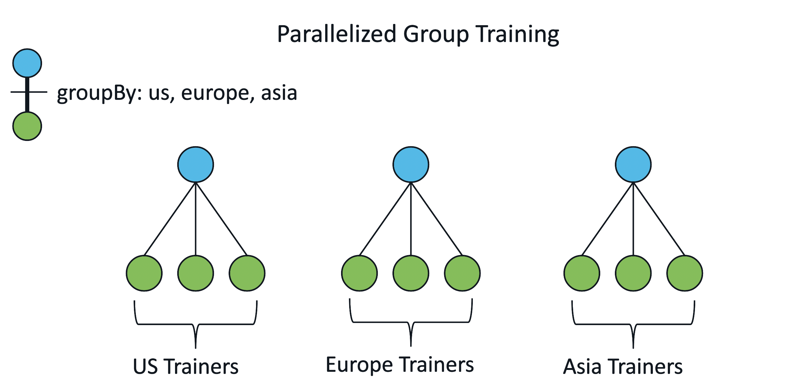
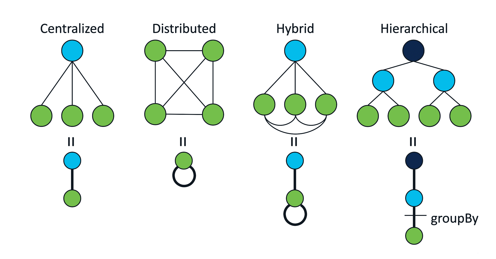

# Flame Basics

This section presents key concepts and building blocks of Flame.

## Organization

In order to be compatible with real-world systems, flame runs different nodes in a federated learning graph as different processes.
That is, if you are training on 10 separate client-side datasets with 1 server, you will need to run 11 different processes (10 client processes and 1 server process).
We also use vocabulary like aggregator to describe, in a more general sense, the role of a server and trainer for the client role.

Instead of creating separate `main.py` files for different trainers (or any other role), we only need to make one and create different configuration files which the same `main.py` file can take as input.

In order to separate different federated learning systems, we use a unique identifier: a **job ID**.
This ID is specified in all the configuration files under config['job']['id'].
This keeps FL graphs disconnected from each other if we are running multiple different federated learning systems at once (such as training multiple global models for different datasets using mutually exclusive trainers).

A second kind of ID is used in order to uniquely identify the processes within a job, a **task ID**.
This is specified at the top of each configuration file under config['taskid'].
This ID should be different for every configuration under the same job ID.

Basically, each **configuration file** defines what one instance of a role (say, a trainer for example) is supposed to do.
It can contain information such as the communication channels open between different process, and also parameters such as the learning rate, weight decay, and the number of rounds for the entire federated learning process to complete.

## Topology Abstraction Graph (TAG)

The topology abstraction graph (TAG) is a simple graph, which allows users to express machine learning training workload declaratively
while it decouples actual implementation of the workload from the topology.

The key benefits of the abstraction are:
- intent-driven
- high modularity
- high extensibility

**Intent-driven**: The TAG allows intent-driven composition of a workload. Users don't need to know low-level details of how communication should take place and how many workers are needed at the workload design phase. All users should care about is who should talk to whom.

**High modularity**: The abstraction of TAG provides the freedom of underlying communication mechanisms.
Depending on the availability of different communication infrastructures and security policies,
a workload can be easily changed from one communication technology to another.

**High extensibility**: TAG makes it easy to support a variety of different topologies. Therefore, it can potentially support many different use cases easily.

<p align="center"></p>


Now let us describe how TAG is enabled. TAG is comprised of two basic and yet simple building blocks: *role* and *channel*.
A *role* represents a vertex in TAG and should be associated with some behaviors.
To create association between role and its behavior, a (python) code must be attached to a role.
Once the association is done, a role is fully *defined*.

A *channel* is an undirected edge between a pair of roles. It is an abstraction for communication backend or protocols.

Each of the two building blocks can have attributes. Attributes further define what these building blocks can do.

For role, it has two attributes: *isDataConsumer* and *replica*.

**isDataconsumer**: this is a boolean attribute to denote that a role is supposed to consume data.
If the attribute is set, it indicates workers created from this role are training workers.
It has an important implication, indicating the number of specified datasets corresponds to the number of workers from the role with isDataConsumer attribute set.

**replica**: This is applied to the roles with no isDataConsumer attribute set. This feature is for high availability.

A channel also has two attributes: *groupBy* and *funcTags*. 

**groupBy**: This attribute is used to group roles of the channel based on a tag.
Therefore, the groupBy attribute allows to build a hierarchical topology (e.g., a single-rooted multi-level tree), for instance, based on geographical location tags (e.g., us, uk, fr, etc).
Currently a string-based tag is supported. Future extensions may include more dynamic grouping based on dynamic metrics such as latency, data (dis)similarity, and so on.

**funcTags** This attribute (discussed later in detail) contains what actions a role would take on the channel.
As mentioned earlier, a role is associated with executable code.
When a role attached to a channel, the role expresses what actions (i.e., functions) it takes on the channel, which is achieved via funcTags attribute.
We will discuss how to use funcTags correctly in the later part.

### TAG Example 1: Two-Tier Topology
In flame, a topology is expressed within a concept called *schema*. 
A schema is a reusable component as a template.
The following presents a simple two-tier cross-device topology.

```json
{
    "name": "A sample schema",
    "description": "a sample schema to demonstrate a TAG layout",
    "roles": [
		{
			"name": "trainer",
			"description": "It consumes the data and trains local model",
			"isDataConsumer": true
		},
		{
			"name": "aggregator",
			"description": "It aggregates the updates from trainers",
		}
    ],
    "channels": [
		{
			"name": "param-channel",
			"description": "Model update is sent from trainer to aggregator and vice-versa",
			"pair": [
				"trainer",
				"aggregator"
			],
			"groupBy": {
			"type": "tag",
			"value": [
				"default"
			]
		    },
			"funcTags": {
				"trainer": ["fetch", "upload"],
				"aggregator": ["distribute", "aggregate"]
			}
		}
    ]
}
```

In the above schema, there are two roles: *aggregator* and *trainer*.
For *trainer*, *isDataconsumer* attribute is set.
This implies that the role *trainer* conducts data processing (e.g., training).
When datasets are selected (more details [here (not yet updated)]()), each dataset is associated with one worker of the role with the attribute set.
Therefore, in the flame system, **the number of datasets will drive the number of data-consuming workers** (e.g., trainer in this case).
Subsequently, the number of non data-consuming workers is derived from the entries in the *groupBy* feature (more on [later]()).

Now let's look at channels. Channels are expressed as a list. A channel consists of four key attributes: *name*, *pair*, *groupBy* and *funcTags*.
The *name* attribute is used to uniquely identify a channel.
The *pair* attribute contains two roles that constitute the channel; each role takes one of the channel.
For the correctness, roles in the pair must exist in the role list.

The *groupBy* attribute allows how to group or cluster workers of two ends (or roles) in the channel. It's optional.
If this attribute is not defined, workers belonging to the channel are grouped into a default group.

With *pair* and *groupBy*, a channel only specifies what roles constitute a channel and how they are grouped.
But it doesn't know what actions each role takes on the channel. The *funcTags* attribute allows *dynamic* binding of functions to a channel.
The software code attached to a role must define a set of functions that it wants to expose to users
so that the users can specify it in the schema. Therefore, it allows more complex operations on a channel.

To ease the specification of function tags, an implementation of a role defines a class method called `get_func_tags(cls)`.
For example, in `lib/python/flame/mode/horizontal/aggregator.py`, the following class function is implemented in the class Aggregator:
```python
@classmethod
def get_func_tags(cls) -> list[str]:
	"""Return a list of function tags defined in the aggregator role."""
	return [TAG_DISTRIBUTE, TAG_AGGREGATE]
```

Note that keys used in *funcTags* (e.g., "trainer" or "aggregator") do not have direct relation to classes
such as Aggregator or Trainer in the `lib/python/flame/mode/horizontal/`. Those keys are only meaningful in the schema.
And *funcTags* is updated at the time when code is associated with a role in the schema.

With the above configuration, the deployed topology looks like as follows.

<p align="center"></p>

### TAG Example 2: Hierarchical Topology

The hierarchical topology is very similar to the simple two-tier topology except that the hierarchical topology requires *groupBy* attribute.

```json
{
    "name": "A simple example schema v1.0.1",
    "description": "a sample schema to demonstrate the hierarchical FL setting",
    "roles": [
		{
	    	"name": "trainer",
		    "description": "It consumes the data and trains local model",
		    "isDataConsumer": true
		},
		{
		    "name": "middle-aggregator",
		    "description": "It aggregates the updates from trainers"
		},
		{
		    "name": "top-aggregator",
	    	"description": "It aggregates the updates from middle-aggregator"
		}
    ],
    "channels": [
		{
		    "name": "param-channel",
		    "description": "Model update is sent from trainer to middle-aggregator and vice-versa",
		    "pair": [
				"trainer",
				"middle-aggregator"
	    	],
	    	"groupBy": {
			"type": "tag",
			"value": [
				"default/us",
				"default/europe",
				"default/asia"
			]
	    	},
	    	"funcTags": {
			"trainer": ["fetch", "upload"],
			"middle-aggregator": ["distribute", "aggregate"]
			}
		},
		{
		    "name": "global-channel",
		    "description": "Model update is sent from middle-aggregator to top-aggregator and vice-versa",
		    "pair": [
				"top-aggregator",
				"middle-aggregator"
	    	],
		    "groupBy": {
			"type": "tag",
			"value": [
				"default"
			]
		    },
		    "funcTags": {
			"top-aggregator": ["distribute", "aggregate"],
			"middle-aggregator": ["fetch", "upload"]
		    }
		}
    ]
}
```

In *roles*, three roles are defined: *top-aggregator*, *middle-aggregator* and *trainer*.
To express a three-tier hierarchical topology, we define two channels; one is global-channel and the other is param-channel.
In contrast to the two-tier topology, the role trainer now connects to the role middle-aggregator (intermediate aggregator)
via param-channel and the role middle-aggregator connects to the role top-aggregator (global aggregator) via global-channel.

In the param-channel, *groupBy* attribute is specified. *groupBy* has two elements: *type* and *value*.
*type* is used to determine a grouping method. Currently, only tag-based (i.e., label-based) grouping method is supported.
When *type* is "tag", the value are a list of tags (i.e., labels).
The above example uses "us", "europe" and "asia" as labels and is visualized as follows.

<p align="center"></p>

#### How to move from 2-tier to hierarchical topology
From 2-tier to hierarchical (e.g., 3-tier), you need to have one more role in between top aggregator and trainer, so you add middle aggregator into the topology (i.e., schema), which also require you to define new channels connecting between each two roles. In order for the hierarchical concept to work, the `groupBy` of upstream channel shouldn't be more specific than the downstream channel.
Likewise, when you want to expand to 4-tier topology, you will need a new channel definition connecting between two middle aggregators.

However, it is still unclear how workers are grouped together at run time.
A brief answer is as follows: in the flame system, before workers are created, they are configured with an attribute called *realm*.
This attribute is a logical hierarchical value which is similar to a directory-like structure in a file system.
It basically dictates where workers should be created and to which path the workers belong in the logical hierarchy.
Given this hierarchical information, users can judiciously choose grouping labels.

### TAG Example 3: Parallel Experiments
Flame system allows multiple identical TAGs to run in parallel based on the `groupBy` tag, such as allowing a 2-tier FL task to run in parallel for 3 geographical regions simultaneously (see image below).

<p align="center"></p>

```json
{
    "name": "A sample schema",
    "description": "a sample schema to demonstrate the parallel experiment setting",
    "roles": [
		{
			"name": "trainer",
			"description": "It consumes the data and trains local model",
			"isDataConsumer": true
		},
		{
			"name": "aggregator",
			"description": "It aggregates the updates from trainers",
		}
    ],
    "channels": [
		{
			"name": "param-channel",
			"description": "Model update is sent from trainer to aggregator and vice-versa",
			"pair": [
				"trainer",
				"aggregator"
			],
			"groupBy": {
			"type": "tag",
			"value": [
				"default/us",
				"default/eu",
				"default/asia"
			]
		    },
			"funcTags": {
				"trainer": ["fetch", "upload"],
				"aggregator": ["distribute", "aggregate"]
			}
		}
    ]
}
```

This topology is the same as the 2-tier one except there are additional *value* in the *groupBy* tag.

### TAG Example 4: Distributed Learning
Flame system allows distributed training besides federated learning. In TAG, it's creating a self-loop (see image below) to allow channel communication between trainers so that algorithms such as ring all-reduce can be used to train the model utilizing multiple trainers.

<p align="center"></p>

```json
{
    "name": "A sample schema",
    "description": "a sample schema to demonstrate the distributed training setting.",
    "roles": [
	{
	    "name": "trainer",
	    "description": "It consumes the data and trains local model",
	    "isDataConsumer": true
	}
    ],
    "channels": [
	{
	    "name": "param-channel",
	    "description": "Model update is sent from trainer to other trainers",
	    "pair": [
			"trainer",
			"trainer"
	    ],
	    "groupBy": {
			"type": "tag",
			"value": [
		    	"default/us"
		]
	    },
	    "funcTags": {
			"trainer": ["ring_allreduce"]
	    }
	}
    ]
}
```

### TAG Example 5: Hybrid Model (TODO)

