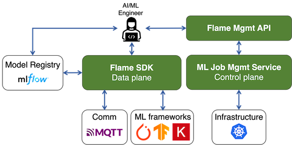

# Introduction

## What is Flame?

The vision of Flame is to democratize federated learning (FL). In that regard, it is the goal of the project that makes FL training as easy and productive as possible for data scientists and machine learning engineers. In particular, as applications and use-cases are emerging in the edge computing space, Flame aims to facilitate FL at the edge.

As FL is a fast evolving technology, Flame tries to decouple the development of a machine learning workload from its deployment and management.
With Flame, a diverse of set of topologies (e.g., central, hierarchical, vertical, hybrid, etc.) can be easily composed
and different backend communication protocols (e.g., mqtt) can be supported.
We cover these core functionalities of Flame [here](flame-basics.md).

## Overview

Flame is a platform that allows developers to compose, deploy and manage FL training workloads easily.
The system is comprised of a service (control plane) and a python library (data plane).
In this document, service and control plane are used interchangeably unless mentioned otherwise.
Similarly, for python library and data plane.

The service manages machine learning workloads.
Specifically, the service is responsible for managing operational tasks.
Those are, for instance, allocating/deallocating compute resources, assisting users to design a FL job,
deploying the FL job across many devices based on the specification of the job, etc.
On the other hand, a python library facilitates composition of ML workloads and enables actual FL training.
That's why we use the term (data plane) for the library.

The figure above provides an overview of the flame system.
The control plane consists of four main components: apiserver, controller, notifier and flamelet.
In addition, we rely on MongoDB to store state and information about the system and FL jobs.
Explanation on the service components is found [here](system/workflow.md#system-workflow).

A user (herein AI/ML engineer) interacts with the flame system in three ways.
The user first uses the flame python library (Flame SDK from the figure)
to write machine learning code for his/her specific training task (e.g., regression, classification, image segmentation, etc).

Scheduling and executing a FL job requires interactions with the flame system through flame management API.
Specifically, there is a cli tool `flamectl` that implements various functionalities based on flame management API.
The user can use the tool to interact with the flame control plane.

The final interface available to the user is a model registry, which maintains artifacts such as ML models.
Currently, the flame system supports mlflow as its model registry.
Future supports may include registry on top of object storages such as MinIO.

---
## Table of Contents

### General

#### [Quickstart (Ubuntu)](quickstart-ubuntu.md)

#### [Quickstart (macOS)](quickstart-mac.md)

#### [Prerequisites](prerequisites.md)

#### [Flame Basics](flame-basics.md)

#### [Changelog](changelog.md)

#### [Contributor Guide](contributor-guide.md)

### Flame SDK (Data Plane) Docs

#### [Flame SDK](sdk/flame-sdk.md)

### Flame System (Control Plane) Docs

#### [Flame in a box (fiab)](system/fiab.md)

#### [System Workflow](system/workflow.md)

#### [Examples](system/examples.md)

#### [Flame CLI Tool](system/flamectl.md)

#### [User Workflow](system/user-workflow.md)
