# Fiab installation in Linux
This guideline is mainly for Ubuntu in a x86 machine and steps can be followed for other Linux distributions with their respective package managers.
## Prerequisites
For Linux, no VM hypervisor is needed. The following tools are sufficient: `minikube`, `kubectl`, `helm`, `docker` and `jq`.
These tools can be installed by either running an automation script or by running manual steps.

To run an automation script, run the following commands:

```bash
cd fiab
./install.sh ubuntu
```

Then, the following manual steps can be skipped; directly go to [starting minikube](#starting-minikube).

### step 1: Installing minikube
We install the latest minikube stable release on x86-64 Linux using binary downloaded from [here](https://minikube.sigs.k8s.io/docs/start/).

### step 2: Installing kubectl, helm and jq
To install [kubectl](https://kubernetes.io/docs/tasks/tools/install-kubectl-linux/#install-using-other-package-management).
```bash
sudo snap install kubectl --classic
kubectl version --client
```
To install [helm](https://helm.sh/docs/intro/install/).
```bash
sudo snap install helm --classic
```
To install jq.
```bash
sudo apt update
sudo apt install -y jq
```
### step3: Install docker
1. Update the apt package index and install packages to allow apt to use a repository over  HTTPS.
```bash
sudo apt-get update
sudo apt-get install \
    ca-certificates \
    curl \
    gnupg \
    lsb-release
```
2. Add Docker’s official GPG key.
```bash
sudo mkdir -p /etc/apt/keyrings
curl -fsSL https://download.docker.com/linux/ubuntu/gpg | sudo gpg --dearmor -o /etc/apt/keyrings/docker.gpg
```
3. Use the following command to set up the repository.
```bash
echo \
  "deb [arch=$(dpkg --print-architecture) signed-by=/etc/apt/keyrings/docker.gpg] https://download.docker.com/linux/ubuntu \
  $(lsb_release -cs) stable" | sudo tee /etc/apt/sources.list.d/docker.list > /dev/null
```
4. Update the apt package index, and install the latest version of Docker Engine.
```bash
sudo apt-get update
sudo apt-get install docker-ce docker-ce-cli containerd.io docker-compose-plugin
sudo groupadd docker
sudo usermod -aG docker $USER && newgrp docker
```

## Starting minikube
When minikube is instantiated, the default resource allocation is 2 CPU, 4GB memory and 20GB disk.
In order to change these parameters, use `--cpus`, `--memory` and `--disk-size` respectively.
The recommended resource allocation is 4 CPUs, 4GB of memory and 100GB of disk space.
```bash
minikube start --cpus 4 --memory 4096m --disk-size 100gb
```
When `docker` driver is in use, run ```minikube config set driver docker``` to make docker driver default. These changes will take effect upon a minikube delete and then a minikube start.

Next, `ingress` and `ingress-dns` addons need to be installed with the following command:
```bash
minikube addons enable ingress
minikube addons enable ingress-dns
```

As a final step, a cert manager is needed to enable tls. The `setup-cert-manager.sh` script installs and configures a cert manager for
selfsigned certificate creation. Run the following command:
```bash
./setup-cert-manager.sh
```


## (Optional) Building flame container image
To simply use flame, skip this step and go to the [starting flame step](#starting-flame).
Building flame container image is only needed if a developer makes changes in the source code and wants to test the local changes.

A Docker daemon comes within the minikube VM. To build flame container image, set the environment variables with the following command.

```bash
eval $(minikube docker-env)
```
See [here](https://minikube.sigs.k8s.io/docs/handbook/pushing/#1-pushing-directly-to-the-in-cluster-docker-daemon-docker-env) for more details.

To test the config, run the following:
```bash
docker ps
```
This command will show containers within the minikube.

In order to build flame container image, run the following:
```bash
./build-image.sh
```

**Note**: This setup uses docker-daemon within the minikube VM, any downloaded or locally-built images will be gone when the VM is deleted
(i.e., `minikube delete` is executed). Unless a fresh minikube instance is needed, simply stopping the minikube instance would be useful
to save time for development and testing.

To check the flame image built, run `docker images`. An output is similar to:
```bash
REPOSITORY                                TAG       IMAGE ID       CREATED          SIZE
flame                                     latest    e3bf47cdfa66   22 seconds ago   3.96GB
k8s.gcr.io/kube-apiserver                 v1.22.3   53224b502ea4   7 weeks ago      128MB
k8s.gcr.io/kube-scheduler                 v1.22.3   0aa9c7e31d30   7 weeks ago      52.7MB
k8s.gcr.io/kube-controller-manager        v1.22.3   05c905cef780   7 weeks ago      122MB
k8s.gcr.io/kube-proxy                     v1.22.3   6120bd723dce   7 weeks ago      104MB
kubernetesui/dashboard                    v2.3.1    e1482a24335a   6 months ago     220MB
k8s.gcr.io/etcd                           3.5.0-0   004811815584   6 months ago     295MB
kubernetesui/metrics-scraper              v1.0.7    7801cfc6d5c0   6 months ago     34.4MB
k8s.gcr.io/coredns/coredns                v1.8.4    8d147537fb7d   6 months ago     47.6MB
gcr.io/k8s-minikube/storage-provisioner   v5        6e38f40d628d   8 months ago     31.5MB
k8s.gcr.io/pause                          3.5       ed210e3e4a5b   9 months ago     683kB
```

## Starting flame
Open a new terminal window and start the minikube tunnel with the following command:
```bash
minikube tunnel
```
The tunnel creates a routable IP for deployment.


To bring up flame and its dependent applications, `helm` is used.
A shell script (`flame.sh`) to use helm is provided.
Run the following command:
```bash
./flame.sh start
```
The above command ensures that the latest official flame image from docker hub is used.
To use a locally developed image, add `--local-img ` in the above command.

**Note**: The following error may occur during the start.
```console
Error: INSTALLATION FAILED: failed post-install: timed out waiting for the condition
```
This issue may be because container images are large or the Internet connection is slow.
The issue has been reported in minikube [github](https://github.com/kubernetes/minikube/issues/14789).
The latest minikube still doesn't contain the patched component (cri-dockerd 0.2.6).
A workaround is to pull images manually (e.g. `minikube ssh docker pull ciscoresearch/flame:v0.2.2`).
The command `kubectl get pods -n flame` gives a list of pods and their status.
The pods with `ErrImagePull` or `ImagePullBackOff` status are ones that might be affected by the issue.
Identifying the required image can be done by running a `kubectl describe` command
(e.g., `kubectl describe pod -n flame flame-apiserver-5df5fb6bc4-22z6l`);
the command's output will show details about the pod, including image name and its tag.

During the configuration by `flame.sh`, it may ask a password for sudo permission.
The reason for this is to add a dns configuration in `/etc/resolver/flame-test`.
When stopping flame, the script asks again a password to delete `/etc/resolver/flame-test`.

The file may look like the following:
```
domain flame.test
nameserver 192.168.64.62
search_order 1
timeout 5
```
Here `192.168.64.62` is minikube's IP address.

## Validating deployment
To check deployment status, run the following command:
```bash
kubectl get pods -n flame
```

An example output looks like the following:
```console
NAME                                READY   STATUS    RESTARTS       AGE
flame-apiserver-5df5fb6bc4-22z6l    1/1     Running   0              7m5s
flame-controller-566684676b-g4pwr   1/1     Running   6 (4m4s ago)   7m5s
flame-mlflow-965c86b47-vd8th        1/1     Running   0              7m5s
flame-mongodb-0                     1/1     Running   0              3m41s
flame-mongodb-1                     1/1     Running   0              4m3s
flame-mongodb-arbiter-0             1/1     Running   0              7m5s
flame-mosquitto-6754567c88-rfmk7    1/1     Running   0              7m5s
flame-mosquitto2-676596996b-d5dzj   1/1     Running   0              7m5s
flame-notifier-cf4854cd9-g27wj      1/1     Running   0              7m5s
postgres-7fd96c847c-6qdpv           1/1     Running   0              7m5s
```

As a way to test a successful configuration of routing and dns, test with the following commands:
```bash
ping -c 1 apiserver.flame.test
ping -c 1 notifier.flame.test
ping -c 1 mlflow.flame.test
```
These ping commands should run successfully without any errors. As another alternative, open a browser and go to `mlflow.flame.test`.
That should return a mlflow's web page.

## Using Dashboard
Dashboard can be accessed by clicking [here](http://dashboard.flame.test/design).

### Design Creation
From the `Designs` page, a design can be created by clicking on `Create New` button.
After a design is created, the TAG can be created.

<p align="center">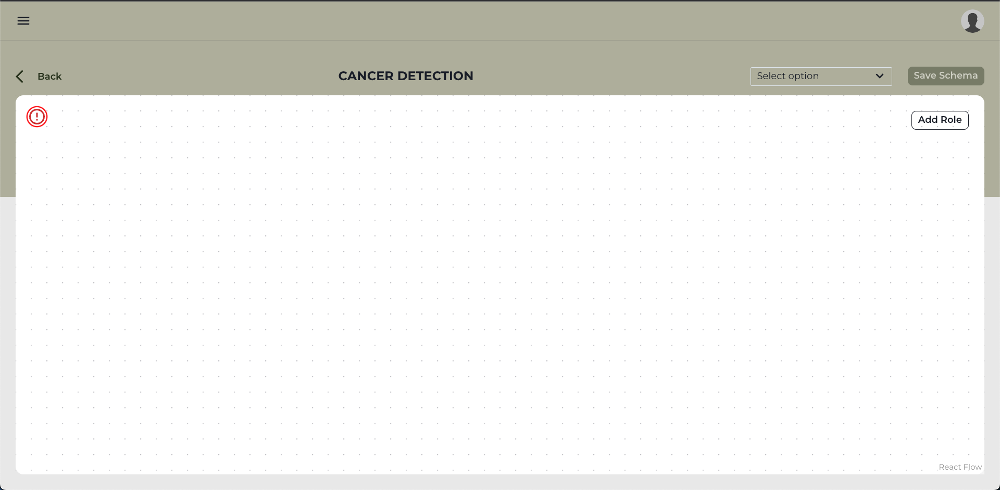</p>

There are two ways to create a TAG:
  1. Selecting a pre-defined template from the drop-down
  2. From scratch by clicking on `Add Role` button.

After the TAG is created, a code file must be associated with each role.
The code file can be added by clicking on each Role and using the file selector from the bottom of the right-hand side drawer.

<p align="center">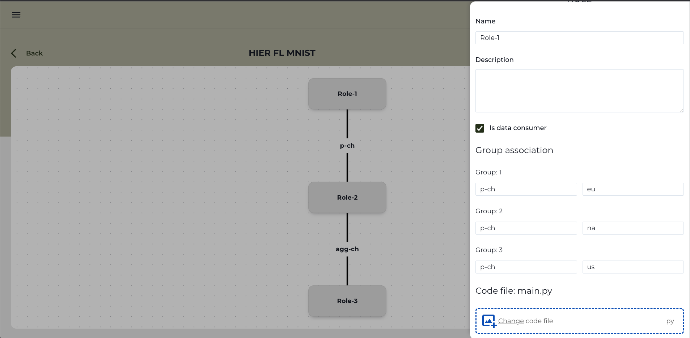</p>

There's also a validation indicator for the TAG on the top-right side of the canvas.

<p align="center">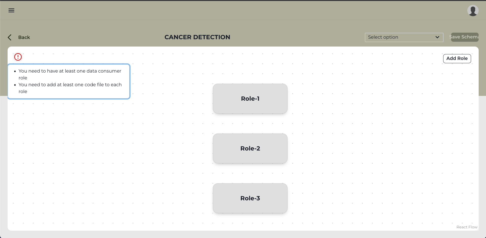</p>

The TAG can be expanded with some simulated workers, by clicking on the `Expand` button.

<p align="center">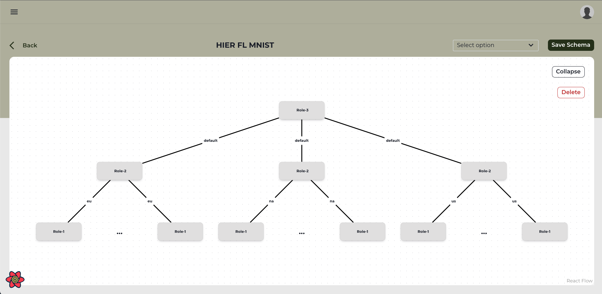</p>

Once the TAG is valid, the `Save Schema` button is enabled and can be clicked.

### Datasets Creation
Navigate to the `Datasets` page from the hamburger menu.

<p align="center">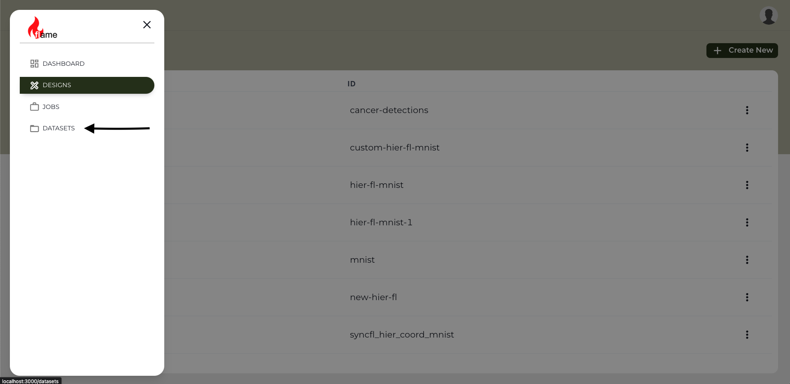</p>

In order to add a new `Dataset`, the `Create New` button must be pressed and input the metadata of the `Dataset`.
Also, for that `Dataset` to be visible, it has to be set as public by checking the `Is Public` checkbox.

<p align="center">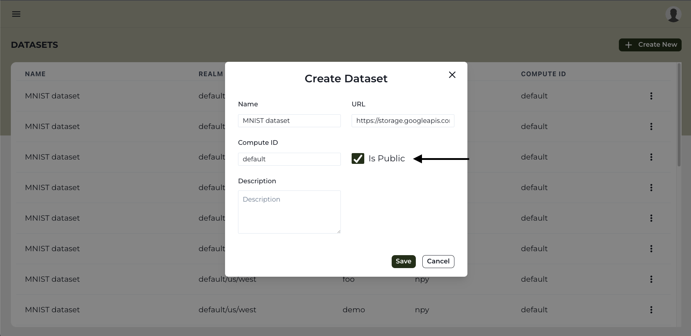</p>

### Job Creation
Next, a `Job` can be created.
Using the hamburger menu, go to `Jobs` page.

<p align="center">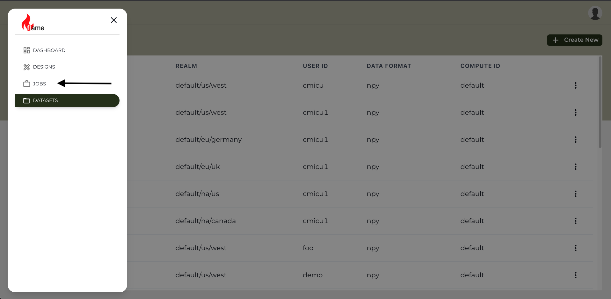</p>

Clicking on the `Create New` button, a stepper will be displayed.

On the first step, fill out the details for `Name`, select a `Design`, select the `Backend` option and add the `Timeout` in seconds.

On the second step, select at least one `Dataset`.

On the last step, if there is a pre-trained model, that can be used by typing it's name and version number. Also, pick the `Optimizer` and `Selector` options and set new `Hyperparameters` or update the default ones.

The `Job` can be saved by clicking on the `Save` button.

### Job execution
From the `Jobs` page, click on the menu icon and select the `Start Job` option.

<p align="center">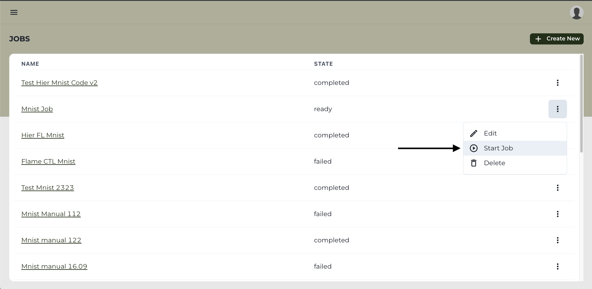</p>

### Job result
After the `Job` is completed, the results of this `Job` can be viewed by clicking on the `Job Name`.
In this page, there is the visualisation of the expanded topology with actual workers.

More details can be displayed by clicking on the `Graph Icon`.

<p align="center">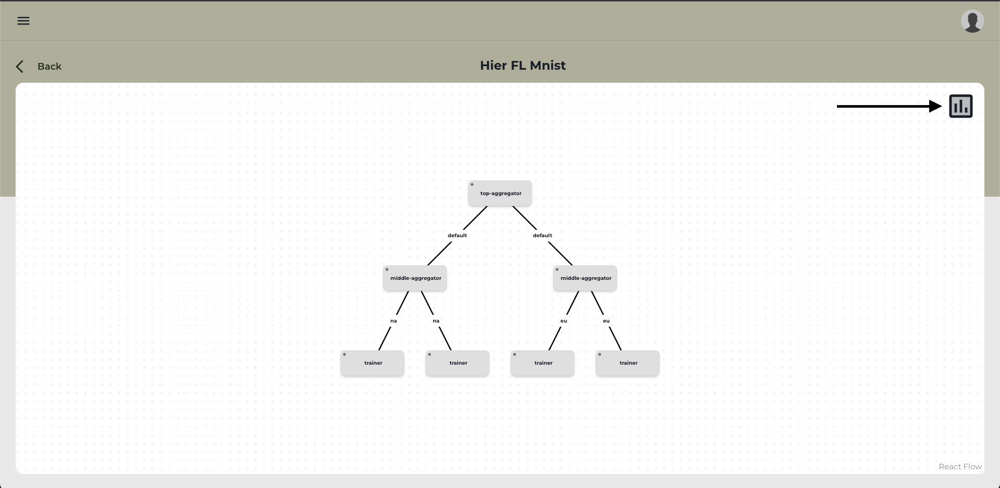</p>

The first section represents a timeline of each worker runtime metrics.

By clicking on each worker, more details can be displayed like: individual metrics, hyper parameters or model artifact.

<p align="center">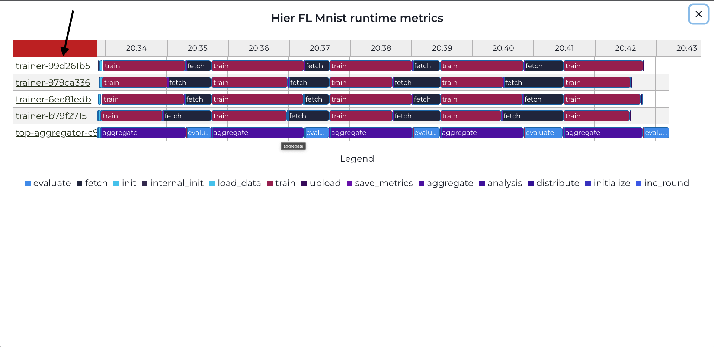</p>

Also, the resulted model can be downloaded by clicking on the download icon.

<p align="center">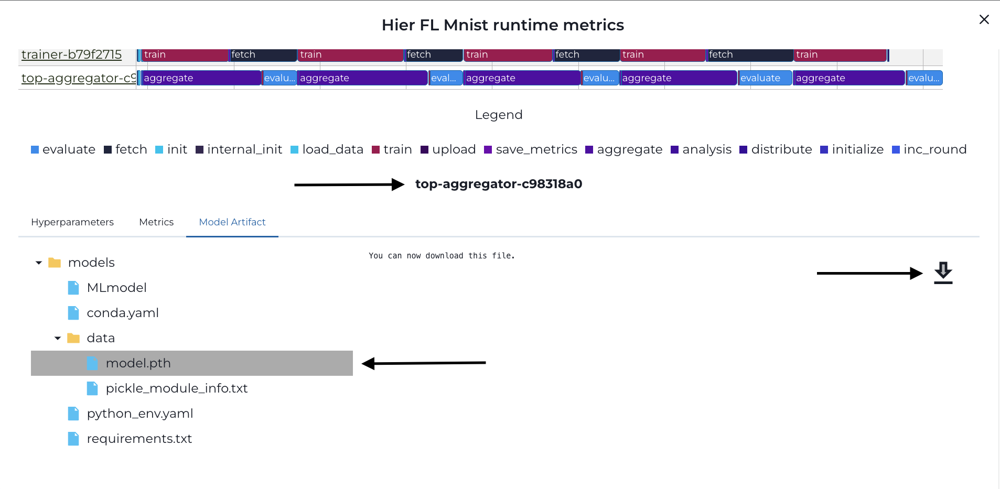</p>

## Stopping flame
Once using flame is done, one can stop flame by running the following command:
```bash
./flame.sh stop
```
Before starting flame again, make sure that all the pods in the flame namespace are deleted.
To check that, use `kubectl get pods -n flame` command.

## Logging into a pod
In kubernetes, a pod is the smallest, most basic deployable object. A pod consists of at least one container instance.
Using the pod's name (e.g., `flame-apiserver-65d8c7fcf4-z8x5b`), one can log into the running pod as follows:
```bash
kubectl exec -it -n flame flame-apiserver-65d8c7fcf4-z8x5b -- bash
```

Logs of flame components are found at `/var/log/flame` in the instance.

## Creating flame config
The following command creates `config.yaml` under `$HOME/.flame`.
```bash
./build-config.sh
```

## Building flamectl
The flame CLI tool, `flamectl` uses the configuration file (`config.yaml`) to interact with the flame system.
In order to build `flamectl`, run `make install` from the level folder (i.e., `flame`).
This command compiles source code and installs `flamectl` binary as well as other binaries into `$HOME/.flame/bin`.
You may want to add `export PATH="$HOME/.flame/bin:$PATH"` to your shell config (e.g., `~/.zshrc`, `~/.bashrc`) and then reload your shell config (e.g., `source ~/.bashrc`).
The examples in [here](examples.md) assume that `flamectl` is in `$HOME/.flame/bin` and the path (`$HOME/.flame/bin`) is exported.

## Cleanup
To terminate the fiab environment, run the following:
```bash
minikube delete
```

**Note**: By executing the above command, any downloaded or locally-built images are also deleted together when the VM is deleted.
Unless a fresh minikube instance is needed, simply stopping the minikube (i.e., `minikube stop`) instance would be useful
to save time for development and testing.

## Running a test ML job
In order to run a sample mnist job, refer to instructions at [mnist example](examples.md#mnist).
