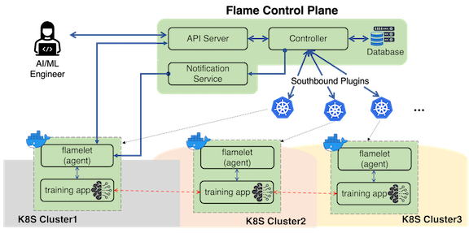

# System Workflow

As aforementioned, the control plane consists of three main components: apiserver, controller, notifier and flamelet.
The apiserver is a front-end of the system; its responsibility is for user authentication, sanity check of requests, etc.
The controller is a core component of the flame system and is responsible for handling user's requests.
As the name stands for, the notifier is a service component that notifies events to flamelet.
The last component, flamelet is an agent that assists the execution of a FL job. It is only executed when a task is deployed.

We use two terms to define a FL job concretely.
One is task and the other is worker. A FL job consists of tasks, which will be executed by workers.
These concepts of task and worker are well established in systems like Apache Spark, MapReduce, etc. And we use them in the similar way.

Given these components, the flame's workflow consists of several steps. The figure above is presented to aid the explanation of the steps.

1. Step 1: A user creates a machine learning job and submits it to the system (e.g., by using `flamectl`).
2. Step 2: The apiserver receives requests and forward it to the controller if requests appears to be valid.
3. Step 3: The controller takes the requests, takes actions, update state in database and returns responses back to the user.
4. Step 4: If the request is to start a job, the controller contacts a cluster orchestration manager(s) (e.g., kubernetes)
and makes worker creation requests.
5. Step 5: The worker (e.g., container or pod) contains flamelet. Then, flamelet in the worker contacts notifier and waits for events.
6. Step 6: As soon as the worker creation is confirmed, the controllers send an event to each of the workers for the job via notifier.
7. Step 7: Once each worker receives an event on a task being assigned to it, it contacts the apiserver and fetches a manifest for the task.
8. Step 8: A manifest is comprised of two elements: ml code and configuration. The flamelet execute the task by creating a child process for the ml code.
9. Step 9: The flamelet monitors the execution of the task and updates the state once the task execution is over.
10. Step 10: In the meantime, the controller also monitors a job's status and take action when necessary (e.g., deallocating workers).

Note that the flame system is in active development and not all the functionalities are supported yet.