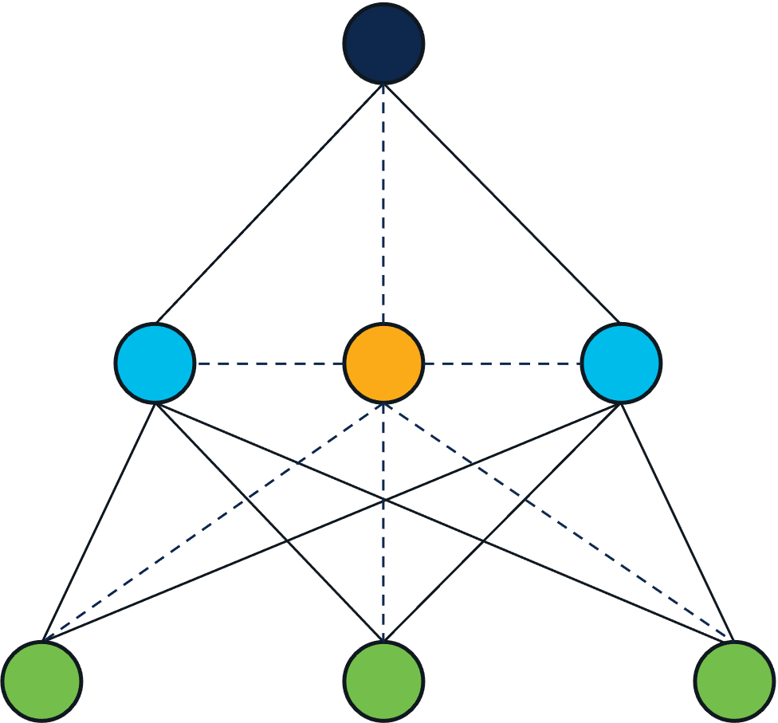

## Synchronous Hierarchical Federated Learning with Coordinator

This example demonstrates a synchronous hierarchical FL with a coodinator.
The coordinator performs the mapping between middle aggregators and trainers for each round.

We use the MNIST dataset to walk through the example.

We assume that a fiab environment is set up properly. To set it up, refer to [this document](../../docs/system/fiab.md).


**Note**: You need to add `--insecure` to all the `flamectl` command when the example is used in a fiab environment.

### Step 1: create a design

```bash
flamectl create design syncfl_hier_coord_mnist -d "an example for synchronous hierarchical FL with coordinator"
```

### Step 2: create a schema 

```bash
flamectl create schema schema.json --design syncfl_hier_coord_mnist
```

The schema defines the topology of this FL job. The following figure visually represents the schema in schema.json.
<p align="center"></p>
For more info on the basic building blocks, please refer to [flame-basics](../../docs/flame-basics.md).

### Step 3: add code to the design

```bash
flamectl create code syncfl_hier_coord_mnist.zip --design syncfl_hier_coord_mnist
```

### Step 4: create datasets

```bash
$ flamectl create dataset dataset1.json
New dataset created successfully
	dataset ID: "629e3095741b82c266a41478"
```

Copy the Dataset ID into `dataSpec.json`, and repeat for other datasets.

```bash
flamectl create dataset dataset2.json
flamectl create dataset dataset3.json
```

Replace the dataset IDs generated with the ones existing in `dataSpec.json`.

Flame will assign a trainer to each dataset. In the schema.json, the replica flag in the role
middle-aggreagator is set to two. Hence, two middle-aggreagator workers are created.
Both of them are associated with the same set of channel groups. 

With the schema and datasets used, the actual topology looks like the following:
<p align="center"></p>

### Step 5: create a job

```bash
$ flamectl create job job.json
New job created successfully
	ID: 642a46ca9d38d312efbb010e
	state: ready
```

If the job is successful created, it returns a job ID.

```bash
$ flamectl get tasks 642a46ca9d38d312efbb010e
+--------------------------+------------------------------------------+--------+-------+--------------------------------+
|          JOB ID          |                 TASK ID                  |  TYPE  | STATE |           TIMESTAMP            |
+--------------------------+------------------------------------------+--------+-------+--------------------------------+
| 642a46ca9d38d312efbb010e | 14d932aa76852ecbb1e25c3be3f17a351e180997 | system | ready | 2023-04-03 03:23:54.508 +0000  |
|                          |                                          |        |       | UTC                            |
| 642a46ca9d38d312efbb010e | 1a832797cbd5495ff11061af3168168443d15632 | system | ready | 2023-04-03 03:23:54.515 +0000  |
|                          |                                          |        |       | UTC                            |
| 642a46ca9d38d312efbb010e | 390848d2b42e6eef7f02987a71b6b3f568f774f3 | system | ready | 2023-04-03 03:23:54.501 +0000  |
|                          |                                          |        |       | UTC                            |
| 642a46ca9d38d312efbb010e | 3938658019a79f5d988f1983b73caa705fef7924 | system | ready | 2023-04-03 03:23:54.49 +0000   |
|                          |                                          |        |       | UTC                            |
| 642a46ca9d38d312efbb010e | 47ee424a928c7f5060e245b2dfc95013f49bf2e6 | system | ready | 2023-04-03 03:23:54.551 +0000  |
|                          |                                          |        |       | UTC                            |
| 642a46ca9d38d312efbb010e | b760731e46d1dced88e2207d9197a585245b94ad | system | ready | 2023-04-03 03:23:54.526 +0000  |
|                          |                                          |        |       | UTC                            |
| 642a46ca9d38d312efbb010e | e8dd57c9fdb51df19981542501290dd3def21115 | system | ready | 2023-04-03 03:23:54.539 +0000  |
|                          |                                          |        |       | UTC                            |
+--------------------------+------------------------------------------+--------+-------+--------------------------------+
```
There should be 7 tasks for this particular job according the schema defined. There will be 1 top aggregator, 2 middle aggregator (1 for na, 1 for eu), and 4 trainers (2 for na, 2 for eu).

### Step 6: start running

```bash
flamectl start job 642a46ca9d38d312efbb010e
```

During running, you can check the status of job by going to [http://mlflow.flame.test](http://mlflow.flame.test) or running `flamectl get tasks ${JOB_ID}` on the command line.

