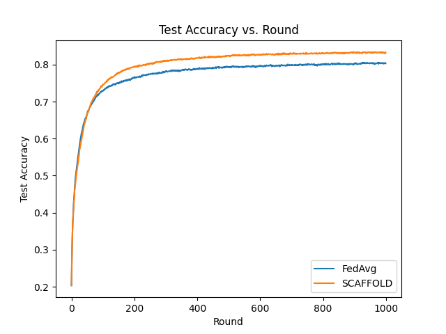

## SCAFFOLD CIFAR-10 Example

We use the CIFAR-10 dataset to go over an example of [SCAFFOLD](https://arxiv.org/abs/1910.06378).
SCAFFOLD includes a modified local gradient step that takes into account a guess for the direction that other trainers would use.
This allows the influence of other datasets to be present during the local training process.
The SCAFFOLD algorithm uses a hyperparameter k which represents the number of batches to be used in training.
The trainer calculates the value of `self.epochs` internally using the formula `epochs = ceil(k / batches_per_epoch)`.
A counter keeps track of the number of batches used, so that the user can call `self.training_is_done()` to determine whether or not to break out of the training loop.
While other algorithms use the hyperparameter `epochs`, SCAFFOLD only requires `k`, `batch_size`, and `dataset_size` in order to ensure the same number of batches are used in each trainer.

This example can be run in the conda environment, so we activate the environment first.
Once you are in the `examples` directory, run the following command.

```bash
conda activate flame
```

If everything in the two `template.json` files represents the desired hyperparameters you would like, go head and run the following code to run the SCAFFOLD example:

```bash
python run.py cifar10_scaffold
```

This will generate the different config files needed to run the example with 100 trainers and 1 aggregator (the example is one of the largest in the repository).
100 rounds can take about 20 minutes if all processes are running on an A100 GPU.

All output that is generated during runtime will be stored in the `cifar10_scaffold/output` folder.
This includes all log files and data that were downloaded for the trainers/aggregator.
If you wish to log the metrics, you can set the registry to 'local' in the config file for the aggregator's `template.json`.
Re-running the experiment will automatically delete the current `output` folder and recreate it with the files generated in the current run.

To check the progress at this level, you can run the following command to check on the global model's accuracy:

```bash
cat cifar10_scaffold/output/aggregator/log.txt | grep -i accuracy
```

Once the model is done training, the command below should return 100 (or the number of specified rounds, if that was changed).

```bash
cat cifar10_scaffold/output/aggregator/log.txt | grep -i accuracy | wc -l
```

Below is a comparison of global test accuracy from using SCAFFOLD (k=50) and FedAvg (E=5) over the course of 1000 rounds.
The number of batches that were used to train is equal across all trainers (FedAvg and SCAFFOLD), since the training dataset sizes are equal.



