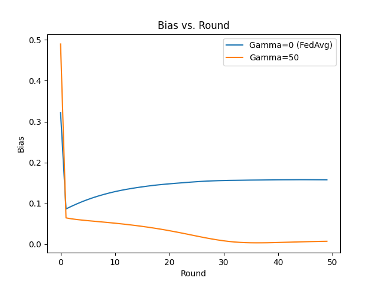
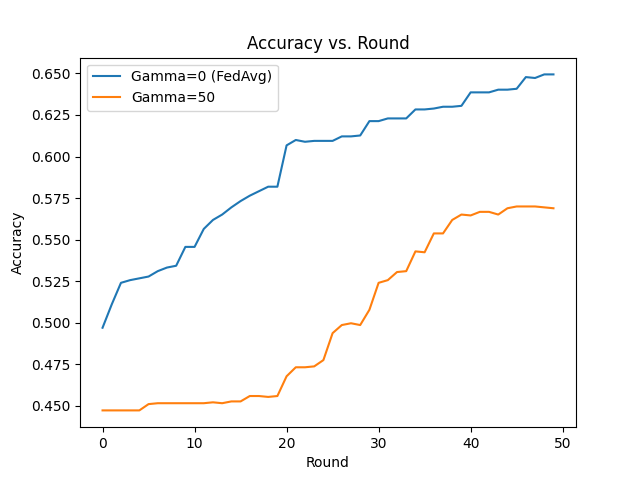
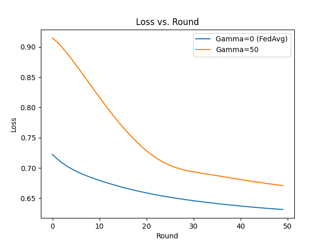

## FedGFT COMPAS Example

We use the COMPAS dataset to go over an example of [FedGFT](https://arxiv.org/abs/2305.09931).
FedGFT, similar to FedAvg, averages the weights of the trainers after training.
However, it also modifies the client-side loss function to ensure that the training also optimizes for fairness.
Fairness can be statistical parity (represented as `SP` in the config file), equal opportunity (`EOP`), and well-calibration (`CAL`).
The algorithm uses a hyperparameter gamma which can be in the range [0, inf) to specificy how important minimizing for bias is.
A value of 0 would mean the loss function is not modified, so there is no mathematical difference between FedAvg and FedGFT with gamma=0.
The gamma value can be specified in both `template.json` files in the `trainer` and `aggregator` folders.

We chose the most strict value to enforce fairness (gamma=50) used in the [Mitigating Group Bias in Federated Learning: Beyond Local Fairness](https://arxiv.org/abs/2305.09931) paper.
We also chose to measure the effects of minimization on statistical parity (`SP`).

This example can be run in the conda environment, so we activate the environment first.
Once you are in the `examples` directory, run the following command.

```bash
conda activate flame
```

If everything in the two `template.json` files represents the desired hyperparameters you would like, go head and run the following code to run the FedGFT example:

```bash
python run.py compas_fedgft
```

This will generate the different config files needed to run the example with 10 trainers and 1 aggregator.

All output that is generated during runtime will be stored in the `compas_fedgft/output` folder.
This includes all log files and data that were downloaded for the trainers/aggregator.
If you wish to log the metrics, you can set the registry to 'local' in the config file for the aggregator's `template.json`.
Re-running the experiment will automatically delete the current `output` folder and recreate it with the files generated in the current run.

To check the progress at this level, you can run the following command to check on the global model's accuracy:

```bash
cat compas_fedgft/output/aggregator/log.txt | grep -i accuracy
```

Once the model is done training you should have that the command below should return 50 (or the number of specified rounds, if that was changed).

```bash
cat compas_fedgft/output/aggregator/log.txt | grep -i accuracy | wc -l
```

Below is a comparison of global bias, accuracy, and loss values using gamma=0,50.






