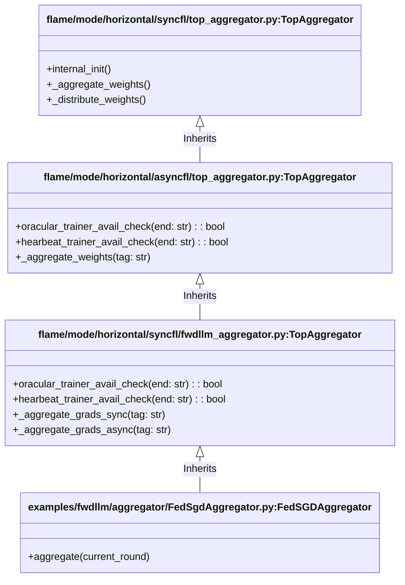

# Data
The system by default caches the data on each run and builds a key based on max sequence length and partition type. 
If you change the partition itself keeping the partition ID same, you need to refresh the cache. 


Comment [this](https://github.com/dhruvsgarg/flame/blob/bc0c43c04ce0be2e0df85e5e1c0860b362ce7880/lib/python/examples/fwdllm/data_manager/base_data_manager.py#L590-L619) to force re-load and fetch from cache. TODO(ARM) : Change this to a flag.

# Aggregator Class Hierarchy in FwdLLM

This document outlines the inheritance hierarchy of the Aggregator classes used in FwdLLM to help understand where specific methods are defined and why some might be redundant.

## Hierarchy Overview


## Aggregation & Distribution Hierarchy (Sync & Async)

Here is the function call hierarchy for both the aggregate and distribute methods across their async and sync workflows. Methods decorated with `@timer_decorator` are marked with a ⏱️.

### 1. `_aggregate_weights(tag)`

#### **Sync Flow** (`is_async == False`)
```text
_aggregate_weights
└── ⏱️ _aggregate_grads_sync
    ├── ⏱️ collect_and_accumulate_grads (Loops multiple times until agg goal is met)
    │   └── ⏱️ _process_single_trainer_message
    │       └── aggregate_grads_from_trainers
    │
    └── ⏱️ _process_aggregation_goal_met (Called if agg goal is reached)
        ├── add_local_trained_result
        ├── ⏱️ aggregate (Computes variance/model update)
        ├── ⏱️ eval_model (Called if variance is good)
        └── ⏱️ _force_cuda_memory_cleanup
```

#### **Async Flow** (`is_async == True`)
```text
_aggregate_weights
└── ⏱️ _aggregate_grads_async
    ├── ⏱️ _process_single_trainer_message (Processes precisely one received message)
    │   └── aggregate_grads_from_trainers
    │
    └── ⏱️ _process_aggregation_goal_met (Called if agg goal is reached)
        ├── add_local_trained_result
        ├── ⏱️ aggregate (Computes variance/model update)
        ├── ⏱️ eval_model (Called if variance is good)
        └── ⏱️ _force_cuda_memory_cleanup
```

---

### 2. `_distribute_weights(tag, task_to_perform)`

#### **Sync Flow** (`is_async == False`)
```text
_distribute_weights
└── ⏱️ _distribute_weights_sync
    ├── (Waits for peers and fetches ends blockingly)
    ├── ⏱️ _prepare_distribution_payload (Called if variance is good)
    │   ├── get_trainable_param_state_dict
    │   └── aggregate_grad_pool
    └── (Sends the pre-computed payload or the variance requests to the ends)
```

#### **Async Flow** (`is_async == True`)
```text
_distribute_weights
└── ⏱️ _distribute_weights_async
    ├── (Uses selector to fetch valid subsets of ends over AsyncOortSelector)
    ├── ⏱️ _prepare_distribution_payload (Called if variance is good)
    │   ├── get_trainable_param_state_dict
    │   └── aggregate_grad_pool
    └── (Sends the pre-computed payload or the variance requests to the ends)
```
