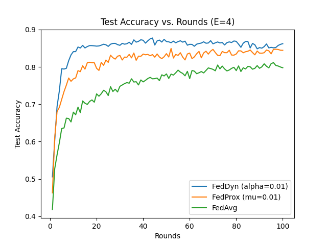

## FedDyn MedMNIST Example

We use the PathMNIST dataset from (MedMNIST)[https://medmnist.com/] to go over an example of FedDyn (alpha=0.01).
Here, the alpha value can be specified in both `template.json` files in the `trainer` and `aggregator` folders.
We chose the most commonly used value in the (Federated Learning Based on Dynamic Regularization)[https://arxiv.org/abs/2111.04263] paper, along with the same `weight_decay` value used (0.001). The learning rate was chosen to be 0.001, because a larger one did not allow the models to train well.

Since we include the `weight_decay` value as a hyperparameter to the feddyn optimizer in the config file, we recommend setting the `self.optimizer`'s `weight_decay` value in `trainer/main.py` to be 0.0, as shown below.

```python
self.optimizer = torch.optim.Adam(self.model.parameters(), lr=1e-3, weight_decay=0.0)
```

This example is run within the conda environment, so we activate the environment first.
Once you are in the `medmnist_feddyn` directory, run the following command.

```bash
conda activate flame
```

If everything in the two `template.json` files represents the desired hyperparameters you would like, go head and run the following code to run the entire example:

```bash
python run.py
```

This will generate the different config files needed to run the example with 10 trainers and 1 aggregator.

All output will be stored in the `output` folder that is generated during runtime.
This includes all log files and data that was downloaded for the trainers/aggregator.
The aggregator folder should also include the list of accuracy/loss values derived from a global test set.
This folder can be deleted and will not affect your ability to re-run the example (in fact, if you re-run the example without deleting this folder, the `output` folder will be deleted first).

To check the progress at this level, you can run the following command to check on the global model's accuracy:

```bash
cat output/aggregator/log.txt | grep -i accuracy
```

Once the model is finished you should have that the command below should return 100 (or the number of specified rounds, if that was changed).

```bash
cat output/aggregator/log.txt | grep -i accuracy | wc -l
```

We compared global test accuracy values using alpha=0.01 to using mu=0.01/0.0 in FedProx (FedProx with mu=0.0 is equivalent to FedAvg).



