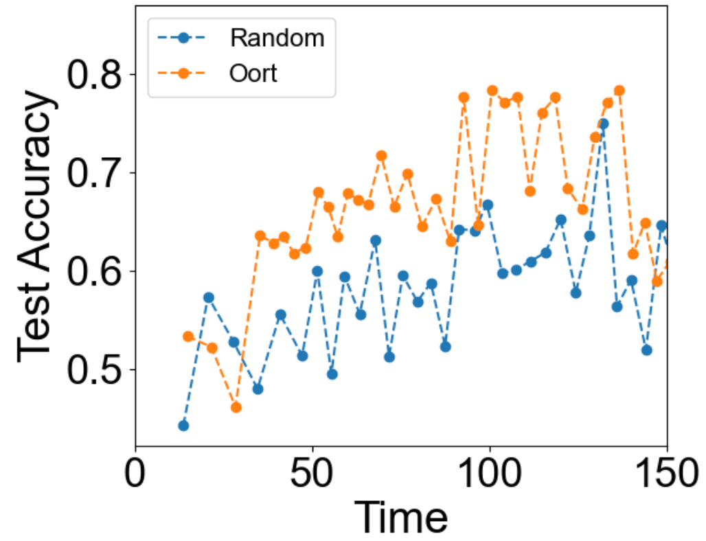

## Oort MedMNIST Example

We use the PathMNIST dataset from (MedMNIST)[https://medmnist.com/] to go over an example of Oort selector.

> [USENIX OSDI'21](https://www.usenix.org/conference/osdi21)
>
> [Oort: Efficient Federated Learning via Guided Participant Selectioni](https://www.usenix.org/conference/osdi21/presentation/lai)

This example is run within conda environment, so we activate the environment first.
Once you are in the `medmnist_oort` directory, run the following command.

```bash
conda activate flame
```

Once this is complete, and say, you want to run the example (using all 10 trainers), you can select a number of trainers K to aggregate per round, and run `python run.py <K>`.
If you want to run the example with aggregating 3 trainers, you can run:

```bash
python run.py 3
```

Note that Oort selects ```floor(1.3 * K)``` trainers at a round, and aggregates ```K``` trainers in order of their model updates' arrival.

We recommend running only one trial at a time.
This way you can track the progress by running the following commands:

```bash
cat output/aggregator/aggregator.log | grep -i Test
```

The below compares the test accuracy over time of Oort with Random selector, both aggregating 3 trainers per round.



