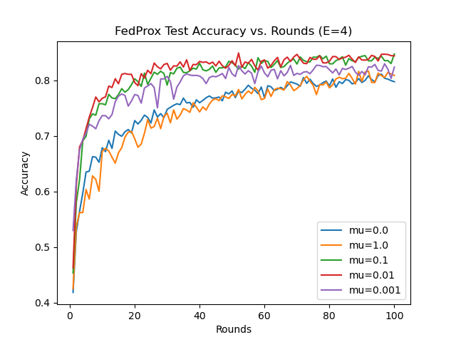
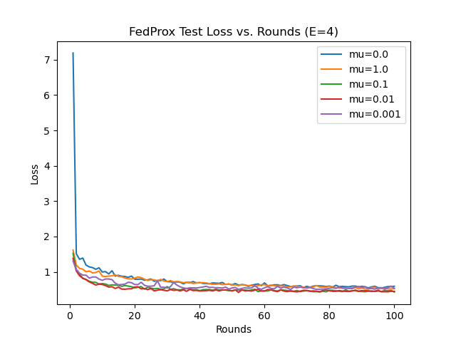

## FedProx MedMNIST Example

We use the PathMNIST dataset from (MedMNIST)[https://medmnist.com/] to go over an example of FedProx with different mu values (mu=1.0, 0.1, 0.01, 0.001, 0.0).
Although FedProx, unlike FedAvg, incorporates stragglers, we will not include stragglers in the following tests.
Thus, we are measuring the effects of the proximal term.

This example is run within conda environment, so we activate the environment first.
Once you are in the `medmnist_fedprox` directory, run the following command.

```bash
conda activate flame
```

Once this is complete, and say, you want to run the example (using all 10 trainers), you can select a value from mu=1.0, 0.1, 0.01, 0.001, 0.0 and run `python run.py <mu>`.
If you want to run the example with `mu=1.0`, you can run:

```bash
python run.py 1.0
```

We recommend running only one trial (or mu value) at a time.
This way you can track the progress by running the following commands:

```bash
cat aggregator/log.txt | grep -i test
```

OR

```bash
cat aggregator/log.txt | grep -i test | wc -l
```

The last command will return 300 when all 100 rounds have finished running.

Once you have finished running all the mu-values, the files that track accuracy/loss accross different rounds should be in the `aggregator` directory.
Without chaning their names, run the command below to generate figures.

```bash
python figures.py
```

The figures will be generated in the `medmnist_fedprox` directory.

We include two of them below. Overall, we found that mu=0.01 was the best value.




